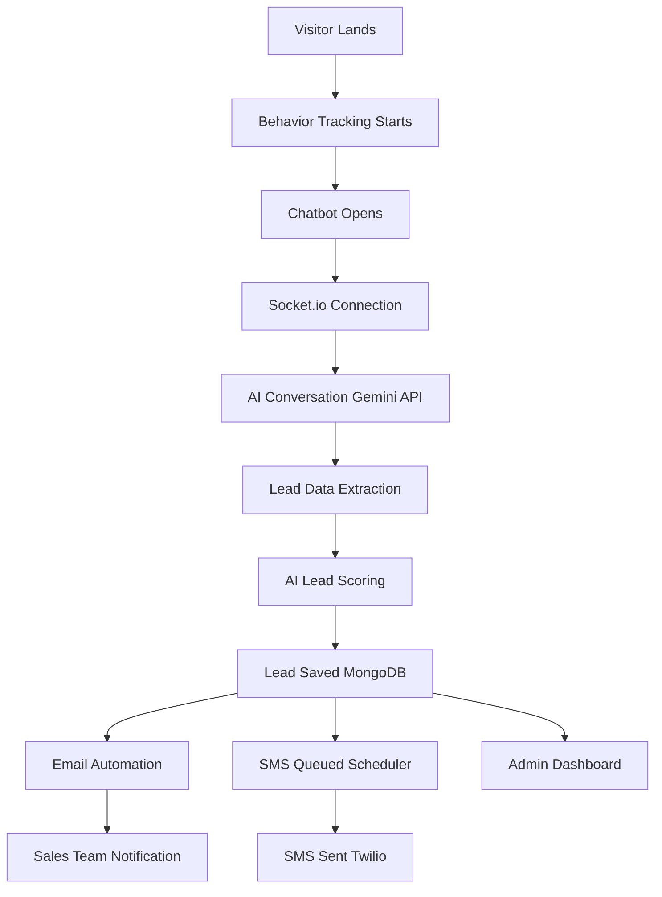

# Lead Generation Chatbot & CRM

**AI-powered lead generation chatbot with integrated CRM dashboard.** Converts website visitors to qualified leads through intelligent conversations, automatic email/SMS outreach, and comprehensive lead management.

## ✨ **Key Features**

### **Chatbot**
- ✅ **AI-Powered Conversations** (Google Gemini API)
- ✅ **Multi-step Lead Qualification** (name, email, phone, company, services, budget, timeline, pain points)
- ✅ **Real-time WebSocket Communication**
- ✅ **Website Behavior Tracking** (pages visited, time spent, services viewed)

### **Lead Automation**
- ✅ **AI Lead Scoring** (0-100 score combining chat quality + behavior)
- ✅ **Smart Lead Classification** (Hot/Warm/Cold/General)
- ✅ **Automated Email Campaigns** (Nodemailer + Template System)
- ✅ **Automated SMS Outreach** (Twilio + Smart Scheduler)
- ✅ **Email + SMS Follow-up Sequences** (24h/48h/7d delays)

### **CRM Dashboard**
- ✅ **Lead Management** (list, detail, search, filter)
- ✅ **Conversation History** (full chat transcripts)
- ✅ **Behavior Analytics** (engagement scores, session data)
- ✅ **Email/SMS Status Tracking**
- ✅ **Template Management** (emails + SMS)

## 🛠️ **Tech Stack**
Frontend: React 18 + Vite + Socket.io-client + Tailwind CSS
Backend: Node.js + Express + MongoDB (Mongoose) + Socket.io
AI: Google Gemini API (chat, extraction, scoring)
Email: Nodemailer (Gmail SMTP)
SMS: Twilio API
Scheduling: Node-cron

## 🎯 **How It Works**

1. Visitor Engagement
- Tracks pages visited, services viewed, time spent
- Calculates behavior score (0-100)
- Real-time session tracking via Socket.io

2. Intelligent Conversations
- Multi-turn qualification (10+ fields collected)
- Context-aware responses via Gemini 1.5 Pro
- Natural qualification flow (no rigid forms)

3. Lead Processing Pipeline
Lead Created → AI Scoring → Classification → Email Template → SMS Queue
Hot: 80+ → Immediate premium outreach
Warm: 50-79 → Balanced nurturing
Cold: <50 → Long-term engagement

4. Automated Outreach
Emails: Instant (lead + sales team)
SMS: Smart delays (0min testing, configurable production)
Follow-ups: 24h/48h/7d sequences

